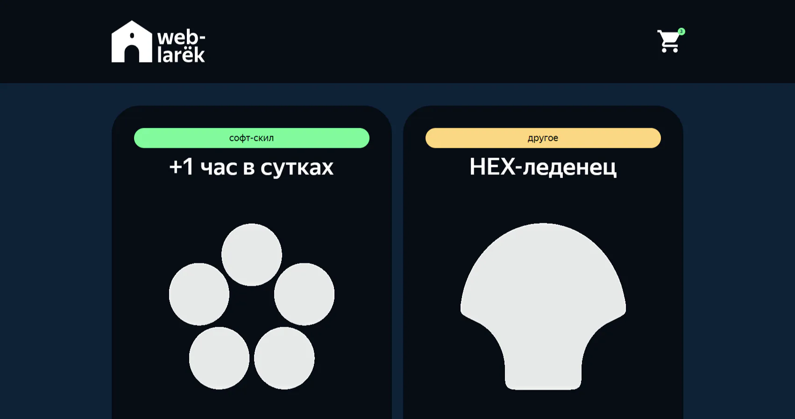

# 🛒 Web-ларёк

<div align="center">


</div>

### Превью проекта



### Интерфейс сайта

[🔗 Посмотреть демо](https://annenkov-konstantin.github.io/web-larek-frontend/) • [💻 Исходный код](https://github.com/Annenkov-Konstantin/web-larek-frontend)

Интернет-магазин на TypeScript, реализованный по паттерну **MVP (Model-View-Presenter)** с событийной архитектурой. Приложение позволяет просматривать каталог товаров, добавлять их в корзину, оформлять заказы с выбором способа оплаты и вводом контактных данных. Все данные синхронизируются с сервером через REST API.

## 📄 Функциональность

- **Каталог товаров** — отображение карточек с изображением, названием, категорией и ценой
- **Карточка товара** — подробная информация о товаре в модальном окне
- **Корзина** — добавление/удаление товаров, подсчёт общей стоимости и количества
- **Оформление заказа** — пошаговая форма с выбором способа оплаты (онлайн/наличные) и указанием адреса
- **Контактные данные** — форма для ввода email и телефона
- **Подтверждение заказа** — модальное окно с суммой списанных средств
- **Счётчик в шапке** — динамическое отображение количества товаров в корзине
- **Модальные окна** — единая система попапов с закрытием по Esc, клику на оверлей и крестик

## 🛠 Стек технологий

- **Вёрстка:** HTML5, SCSS (БЭМ-методология)
- **Язык:** TypeScript (строгая типизация)
- **Сборка:** Webpack (Babel, CSS/SCSS loaders, dev server)
- **Архитектура:** MVP (Model-View-Presenter) + Event-driven
- **API:** REST API (Promise-based)
- **Паттерны:** Observer (EventEmitter), Component-based View

## ✨ Ключевые особенности

### 🏗️ Архитектура MVP

Приложение построено по паттерну **Model-View-Presenter** с чётким разделением ответственности:

- **Model** — хранение и изменение данных, генерация событий
- **View** — отображение данных в DOM, обработка пользовательских действий
- **Presenter** (`index.ts`) — связывание Model и View через события

### 🎯 Событийная архитектура

Взаимодействие между компонентами осуществляется через **брокер событий** (`EventEmitter`):

- Модели генерируют события при изменении данных
- Представления генерируют события при взаимодействии пользователя
- Презентер подписывается на события и координирует работу системы

### 📐 Строгая типизация

Все данные, методы и события типизированы через TypeScript:

- Интерфейсы для моделей данных (`IItemModel`, `IBasketModel`, `ICustomerModel`)
- Типы для частичных данных (`Pick`, `ReturnType`)
- Типизация событий и их payload

### 🎨 Модульная структура

- **Базовый код** — `Api` (HTTP-запросы), `EventEmitter` (брокер событий)
- **Модели** — `ItemsCatalogModel`, `BasketModel`, `CustomerProcessingModel`, `OrderMakerModel`
- **Представления** — `HeaderView`, `ItemCardView`, `BasketListView`, `ModalWrapperView`, `OrderFormView`, `ContactsFormView`

### ⚡ Производительность

- **Webpack** — автоматическая сборка, минификация, tree-shaking
- **Оптимизация DOM** — минимальное количество перерисовок через сеттеры

### ♿ Доступность (a11y)

- **Клавиатурная навигация** — закрытие модалок по Escape
- **Focus management** — управление фокусом при открытии/закрытии попапов
- **Семантическая вёрстка** — правильная иерархия заголовков, форм, кнопок

### 🔒 Управление формами

- **Блокировка отправки** — кнопка submit неактивна, пока форма не заполнена

- **Сброс состояний** — очистка форм и данных после успешного оформления заказа

## 🚀 Запуск

### Самый простой способ

Откройте демо-версию по ссылке: [annenkov-konstantin.github.io/web-larek](https://annenkov-konstantin.github.io/web-larek/)

### Локальный запуск

1. Клонируйте репозиторий:

```bash
git clone https://github.com/Annenkov-Konstantin/web-larek-frontend.git
cd web-larek-frontend
```

2. Установите зависимости:

```bash
npm install
# или
yarn
```

3. Запустите dev-сервер:

```bash
npm run start
# или
yarn start
```

Сайт откроется по адресу `http://localhost:8080` с горячей перезагрузкой.

### Сборка

```bash
npm run build
# или
yarn build
```

Результат сборки будет в папке `dist/`.

## 📁 Структура проекта

```
web-larek-frontend/
├── src/
│   ├── components/           # Компоненты приложения
│   │   ├── base/             # Базовый код
│   │   │   ├── api.ts        # Класс Api для HTTP-запросов
│   │   │   └── events.ts     # Класс EventEmitter (брокер событий)
│   │   ├── Model/            # Слой данных (Model)
│   │   │   ├── ItemsCatalogModel.ts   # Каталог товаров
│   │   │   ├── BasketModel.ts         # Корзина
│   │   │   ├── CustomerProcessingModel.ts  # Данные покупателя
│   │   │   └── OrderMakerModel.ts     # Данные заказа
│   │   └── View/             # Слой представления (View)
│   │       ├── ComponentView.ts       # Базовый класс представления
│   │       ├── HeaderView.ts          # Шапка со счётчиком корзины
│   │       ├── CardView.ts            # Абстрактная карточка
│   │       ├── ItemCardView.ts        # Карточка в галерее
│   │       ├── ModalCardView.ts       # Карточка в модалке
│   │       ├── ItemsGallaryView.ts    # Галерея товаров
│   │       ├── BasketListView.ts      # Список корзины
│   │       ├── CardBasketView.ts      # Элемент корзины
│   │       ├── ModalWrapperView.ts    # Обёртка модального окна
│   │       ├── FormView.ts            # Абстрактная форма
│   │       ├── OrderFormView.ts       # Форма заказа
│   │       ├── ContactsFormView.ts    # Форма контактов
│   │       └── ModalSuccessView.ts    # Окно успеха
│   ├── pages/
│   │   └── index.html        # Главная страница
│   ├── types/
│   │   └── index.ts          # Типы данных
│   ├── utils/
│   │   ├── constants.ts      # Константы
│   │   └── utils.ts          # Утилиты
│   ├── scss/
│   │   └── styles.scss       # Корневой файл стилей
│   └── index.ts              # Точка входа (Presenter)
├── package.json
├── tsconfig.json
├── webpack.config.js
└── README.md
```

## 🧠 Архитектурные решения

### Базовый код

#### Класс `Api`

Содержит базовую логику отправки HTTP-запросов. В конструктор передаётся базовый адрес сервера и объект с заголовками.

**Методы:**

- `get(uri: string): Promise<object>` — GET-запрос, возвращает Promise с JSON-ответом
- `post(uri: string, data: object, method?: string): Promise<object>` — POST/PUT/DELETE запрос с телом

#### Класс `EventEmitter`

Брокер событий для взаимодействия между компонентами. Реализует паттерн **Observer**.

**Методы (интерфейс `IEvents`):**

- `on(eventName: string, handler: Function)` — подписка на событие
- `emit(eventName: string, data?: object)` — инициация события
- `trigger(eventName: string)` — возвращает функцию-триггер для события

### Слой данных (Model)

#### `ItemsCatalogModel`

Хранит и обрабатывает данные каталога товаров.

**Поля:**

- `_catalog: IItemModel[]` — массив товаров
- `_selectedItem: IItemModel` — выбранный товар

**Методы:**

- `processImagesSrc(catalog)` — обработка путей к изображениям
- `setSelectedItem(id)` — выбор товара для модального окна
- `clearSelectedItem()` — очистка выбранного товара
- `getItem(id)` — получение товара для добавления в корзину

#### `BasketModel`

Управляет корзиной покупок.

**Методы:**

- `addItem(item)` — добавление товара
- `removeItem(id)` — удаление товара
- `getQuantity()` — количество товаров
- `getItemsId()` — массив ID товаров
- `getTotalPrice()` — общая стоимость
- `clearBasket()` — очистка корзины

#### `CustomerProcessingModel`

Хранит данные покупателя с валидацией.

**Поля:**

- `_customer: ICustomerModel` — данные покупателя
- `isPhoneValid`, `isEmailValid`, `isAddressValid` — состояния валидации

**Методы:**

- `setCustomerData(userData)` — сохранение данных
- `getIsPhoneValid()`, `getIsEmailValid()`, `getIsAddressValid()` — проверка валидности
- `clearCustomerData()` — очистка данных

#### `OrderMakerModel`

Хранит данные о способе оплаты.

**Методы:**

- `setPayment(value)` — установка способа оплаты
- `getPaymentState()` — состояние валидности
- `getOrder()` — получение данных оплаты
- `clearOrdeData()` — очистка данных

### Слой представления (View)

#### `ComponentView` (абстрактный)

Базовый класс для всех компонентов представления.

**Поля:**

- `_container: HTMLElement` — контейнер компонента

**Методы:**

- `render(data?: Partial<T>)` — обновление данных через сеттеры

#### `HeaderView`

Отображает счётчик товаров в корзине.

**Методы:**

- `basketCounter(quantity)` — установка значения счётчика

#### `CardView` (абстрактный)

Базовый класс для карточек товаров.

**Поля:**

- `_titleElement`, `_priceElement`, `_cardId`

**Методы:**

- `title`, `price`, `id` — сеттеры/геттеры

#### `ItemCardView`

Карточка товара в галерее.

**Методы:**

- `image(src)`, `description(value)`, `category(value)` — сеттеры

#### `ModalCardView`

Карточка товара в модальном окне.

**Методы:**

- `image(src)`, `category(value)`, `description(value)`, `price(value)` — сеттеры
- `buttonState()`, `buttonToBuy()`, `buttonToDelete()` — управление кнопкой

#### `ModalWrapperView`

Обёртка модального окна с обработчиками закрытия.

**Методы:**

- `insertContentAndDisplay(content)` — открытие модалки
- `closemodalWrapperAndClear()` — закрытие модалки

#### `FormView` (абстрактный)

Базовый класс для форм.

**Методы:**

- `spanErrors` — отображение ошибок
- `buttonState` — управление активностью кнопки

#### `OrderFormView`

Форма заказа с выбором оплаты и адреса.

**Методы:**

- `card(value)`, `cash(value)` — выбор способа оплаты
- `clearForm()` — сброс формы

#### `ContactsFormView`

Форма контактных данных.

**Методы:**

- `clearForm()` — сброс формы

#### `ModalSuccessView`

Окно подтверждения заказа.

**Методы:**

- `success(value)` — отображение суммы списания

### 📊 UML-диаграмма классов

Архитектура приложения по паттерну MVP. Синим цветом выделен слой данных, зелёным — слой представления, оранжевым — презентер и брокер событий.

<p align="center">
  <a href="https://github.com/Annenkov-Konstantin/web-larek-frontend/blob/main/docs/uml-class-diagram.png" target="_blank">
    
  </a>
  <br>
  <i>Нажмите на изображение, чтобы открыть в полном размере</i>
</p>

## 📊 Типы данных

### Основные модели

```typescript
interface IItemModel {
	id: string;
	title: string;
	image: string;
	category: string;
	description: string;
	price: number | null;
}

interface IBasketModel {
	itemsList: ItemBasket[];
	addItem(item: ItemBasket): void;
	removeItem(id: string): void;
	getQuantity(): number;
	getItemsId(): string[];
	getTotalPrice(): number;
	clearBasket(): void;
}

interface ICustomerModel {
	phone: string;
	email: string;
	address: string;
}

interface IOrderModel extends ICustomerModel {
	payment: 'card' | 'cash' | '';
}
```

### Частичные типы

```typescript
type ItemBasket = Pick<IItemModel, 'id' | 'title' | 'price'>;
type Payment = Pick<IOrderModel, 'payment'>;
type Address = Pick<ICustomerModel, 'address'>;
type CustomerDataContacts = Pick<ICustomerModel, 'phone' | 'email'>;

type FinalOrderData = ICustomerModel &
	IOrderModel &
	Record<'total', number> &
	Record<'items', string[]>;
```

## 🔄 События

### События изменения данных (генерируются Model)

| Событие                | Описание                                 |
| ---------------------- | ---------------------------------------- |
| `catalog:initialized`  | Обработка и сохранение полученных данных |
| `item:selected`        | Выбор товара в галерее                   |
| `item:added`           | Товар добавлен в корзину                 |
| `item:deleted`         | Товар удалён из корзины                  |
| `order:created`        | Заказ сформирован                        |
| `customerData:changed` | Данные пользователя изменены             |
| `payment:set`          | Установка способа оплаты                 |

### События взаимодействия (генерируются View)

| Событие                        | Описание                   |
| ------------------------------ | -------------------------- |
| `itemsGalleryButton:clicked`   | Клик по карточке в галерее |
| `modalButton:clicked`          | Закрытие модального окна   |
| `cardPreviewButton:clicked`    | Добавление/удаление товара |
| `basketButton:clicked`         | Открытие корзины           |
| `buttonDelete:clicked`         | Удаление товара из корзины |
| `buttonToOrderClicked:clicked` | Начало оформления заказа   |
| `paymentButton:clicked`        | Выбор формы оплаты         |
| `addressInput:changed`         | Изменение адреса           |
| `orderForm:submit`             | Отправка формы заказа      |
| `emailInput:changed`           | Изменение email            |
| `phoneInput:changed`           | Изменение телефона         |
| `contactsForm:submit`          | Отправка формы контактов   |
| `successButton:clicked`        | Закрытие окна успеха       |

## 📬 Контакты

Если у вас есть вопросы по проекту или вы хотите сотрудничать:

- **Сайт:** [pheb.ru](https://pheb.ru/)
- **Email:** pheb@list.ru
- **Telegram:** [@Knfrei](https://t.me/Knfrei)
- **GitHub:** [@Annenkov-Konstantin](https://github.com/Annenkov-Konstantin)

---

<div align="center">

**Если проект был полезен, поставьте ⭐ на GitHub!**

</div>

---
